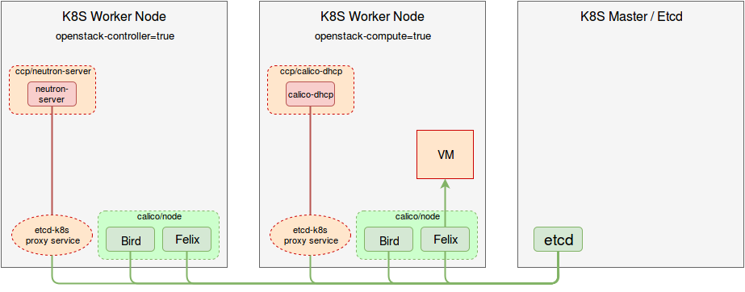

vagrant-k8s
===========
Scripts to:

* Create libvirt lab with vagrant and prepare some prerequirements.
* Deploy Kubernetes with Calico networking plugin on a list of nodes using Kargo.
* Deploy OpenStack Containerized Control Plane (fuel-ccp) with networking-calico on top of k8s.



Requirements
------------

* `libvirt`
* `vagrant`
* `vagrant-libvirt` plugin (`vagrant plugin install vagrant-libvirt`)
* `$USER` should be able to connect to libvirt (test with `virsh list --all`)

Vargant lab preparation
-----------------------

* Change default IP pool for vagrant networks if you want

```bash
export VAGRANT_POOL="10.100.0.0/16"
```

* Clone this repo

```bash
git clone https://github.com/adidenko/vagrant-k8s
cd vagrant-k8s
```

* Prepare the virtual lab

```bash
vagrant up
```

Deployment Kubernetes on your lab
---------------------------------

* Login to master node and sudo to root

```bash
vagrant ssh $USER-k8s-00
sudo su -
```

* Clone this repo

```bash
git clone https://github.com/adidenko/vagrant-k8s ~/mcp
```

* Install required software and pull needed repos

```bash
cd ~/mcp
./bootstrap-master.sh
```

* Set env vars for dynamic inventory

```bash
export INVENTORY=`pwd`/nodes_to_inv.py
export K8S_NODES_FILE=`pwd`/nodes
```

* Check `nodes` list and make sure you have SSH access to them

```bash
cd ~/mcp
cat nodes
ansible all -m ping -i $INVENTORY
```

* Deploy k8s using kargo playbooks

```bash
cd ~/mcp
./deploy-k8s.kargo.sh
```

Deploy CCP on Kubernetes
------------------------

* Make sure CCP deployment config matches your deployment environment
and update if needed. You can also add you CCP reviews here

```bash
cd ~/mcp
cat ccp.yaml
```

* Run some extra customizations

```bash
ansible-playbook -i $INVENTORY playbooks/design.yaml -e @ccp.yaml
```

* Clone CCP installer

```bash
cd ~/mcp
git clone https://github.com/adidenko/fuel-ccp-ansible
```

* Deploy OpenStack CCP

```bash
cd ~/mcp
# Build CCP images
ansible-playbook -i $INVENTORY fuel-ccp-ansible/build.yaml -e @ccp.yaml
# Deploy CCP
ansible-playbook -i $INVENTORY fuel-ccp-ansible/deploy.yaml -e @ccp.yaml
```

* Login to any **k8s master** node and wait for CCP deployment to complete

```bash
# On k8s master node
# Check CCP pods, all should become running
kubectl --namespace=ccp get pods -o wide

# Check CCP jobs status, wait until all complete
kubectl --namespace=ccp get jobs
```

* Check Horizon

```bash
# On k8s master node check nodePort of Horizon service
HORIZON_PORT=$(kubectl --namespace=ccp get svc/horizon -o go-template='{{(index .spec.ports 0).nodePort}}')
echo $HORIZON_PORT

# Access Horizon via nodePort
curl -i -s $ANY_K8S_NODE_IP:$HORIZON_PORT
```

Working with kubernetes
-----------------------

* Login to one of your kube-master nodes and run

```bash
# List images in registry
curl -s 127.0.0.1:31500/v2/_catalog | python -mjson.tool

# Check CCP jobs status
kubectl --namespace=ccp get jobs

# Check CCP pods
kubectl --namespace=ccp get pods -o wide
```

* Troubleshooting

```bash
# Get logs from pod
kubectl --namespace=ccp logs $POD_NAME

# Exec command from pod
kubectl --namespace=ccp exec $POD_NAME -- cat /etc/resolv.conf
kubectl --namespace=ccp exec $POD_NAME -- curl http://etcd-client:2379/health

# Run a container
docker run -t -i 127.0.0.1:31500/mcp/neutron-dhcp-agent /bin/bash
```

* Network checker

```bash
cd ~/mcp
./deploy-netchecker.sh
# or in ccp namespace
./deploy-netchecker.sh ccp
```

* CCP

```bash
# Run a bash in one of containers
docker run -t -i 127.0.0.1:31500/mcp/nova-base /bin/bash

# Inside container export credentials
export OS_USERNAME=admin
export OS_PASSWORD=password
export OS_TENANT_NAME=admin
export OS_REGION_NAME=RegionOne
export OS_AUTH_URL=http://keystone:35357

# Run CLI commands
openstack service list
neutron agent-list
```
